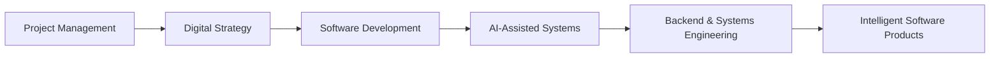

# DANIEL OSWAGO

### Business Strategist → Project Manager → Software Builder

Building practical digital products, AI-assisted systems, and software solutions at the intersection of business, technology, and execution.

I bring a business-first background in project management, sales, marketing, communication, and digital strategy into software and AI systems work. My focus is not simply learning to code — it is using technology to solve real operational and business problems.

  
  
  

---

## The Story

My path has been shaped by business understanding as much as by technical curiosity.

From project delivery and stakeholder coordination to sales, marketing, and digital strategy, I have developed a strong lens for identifying problems, prioritizing work, and creating practical solutions. That experience now informs how I approach software and AI: I think about value, user need, business context, and problem solving before I focus only on the code.

I am building the technical depth to move from:

**identifying business problems → designing solutions → building systems → learning, improving, and delivering them.**

---

## Business Meets Engineering

Business Understanding

↓

Problem Definition

↓

Product / System Thinking

↓

Software Development

↓

AI Integration

↓

Continuous Improvement

I care about building technology that solves actual organizational and operational problems. My interest is in practical systems that help people work better, decide faster, and operate with more clarity.

---

## What I'm Building

- AI-assisted software systems
- business applications with practical utility
- backend systems and runtime logic
- automation for repetitive work
- digital platforms built around clear user needs
- intelligent decision-support tools

The focus is not on demos alone. It is on building systems that make sense in the real world.

---

# 🧠 APOGEE BRAIN

**Apogee Brain — AI-Assisted Intelligence & Engineering System**

[View repository →](https://github.com/Fullsurwa/Apogee-Brain)

Apogee Brain is the flagship project in my public work. It is a local, context-aware AI system designed around operational memory, reasoning support, workflow orchestration, and practical decision-making.

### What it is

Apogee Brain is an evolving system built to bring together:

- local vault and operational context
- runtime orchestration
- structured memory and interaction history
- AI-assisted reasoning and response generation
- fallback model behavior when the primary path is unavailable
- workflow support for status, action, and context-focused tasks

### Why it exists

The repo reflects a real engineering effort to create a system that helps organize context, support decisions, and reduce friction in day-to-day work. It is not just a generic chat wrapper; it is a local operating model that attempts to combine evidence, memory, and AI assistance around a practical workflow.

### What I am learning through it

This project is helping me work through the practical realities of:

- environment configuration and startup validation
- API-driven model integration
- request orchestration and fallback logic
- structured memory and persistence
- local context assembly from operational files
- deterministic workflow handling
- debugging and reliability in local system design

### Technologies present

- JavaScript
- Node.js
- Express
- Anthropic Claude
- Ollama
- markdown/vault-based context files

### Current status

This is an active, evolving engineering project. It is building toward a more useful local AI operating system rather than a polished commercial product.

---

## Other Projects

### Apogee SKOPE Portfolio

[View repository →](https://github.com/Fullsurwa/Apogee-SKOPE-Portfolio)

**Problem →** Create a clear public-facing portfolio and personal brand presence.  
**What I built →** A lightweight HTML-based portfolio repository for presenting work and profile context.  
**Technology →** HTML, static site content, GitHub-ready presentation.  
**Current status →** Public portfolio repository.

### SmartMart Brain

[View repository →](https://github.com/Fullsurwa/SmartMart-Brain)

**Problem →** Turn retail strategy, risk thinking, and sales execution into structured business intelligence.  
**What I built →** Markdown-based strategy and planning documents covering business workflows, risk, retail strategy, and sales support.  
**Technology →** Markdown documentation, strategy notes, and analytical/business planning files.  
**Current status →** Strategic and concept-development work.

---

## Current Engineering Focus

| Area | Current Focus |
| --- | --- |
| Software Engineering | Strengthening core software fundamentals and practical system design |
| Backend | Runtime logic, APIs, server-side systems, and architecture patterns |
| AI | AI-assisted applications, local and hosted model workflows, and intelligent interfaces |
| Databases | Application persistence, structured data, and memory patterns |
| DevOps | Git workflows, deployment workflows, and development environment practices |
| System Design | Understanding how larger systems fit together and behave in real use |
| Product Thinking | Connecting technical solutions to business problems and user value |

---

## Technology Stack

### Software

### AI & Intelligent Systems

- Claude model integration
- local LLM fallback
- AI-assisted workflows
- structured memory and contextual system design

### Engineering Tools

---

## Engineering Philosophy

> Technology should solve a real problem before it solves a technical problem.

I value:

- clarity over cleverness
- maintainability over flash
- practical problem solving over trend-chasing
- communication as an engineering skill
- continuous learning through building
- responsible use of AI as an assistance layer, not a replacement for judgment

---

## Project Management + Software

My project management background gives me more than execution discipline — it gives me a systems lens.

I think about:

- requirements and scope
- prioritization
- stakeholder communication
- risk and delivery realities
- timelines and iteration
- whether a solution is actually worth building

That perspective matters because software is not only about whether a feature can be built. It is also about whether it should be built, why it matters, who it serves, and how it gets delivered.

---

## AI & Intelligent Systems

I am especially interested in building practical AI-assisted systems and intelligent workflows, especially where technology can reduce friction, improve decision-making, and support human execution.

Current areas of interest include:

- AI-assisted development and workflow support
- LLM integration and model orchestration
- intelligent applications with clear business value
- decision-support systems
- automation with human oversight
- AI as a tool for operational clarity and execution support

I am building in this space, not positioning myself as a research scientist; I am focused on practical systems and useful outcomes.

---

## Development Journey

This continues to evolve as I deepen my engineering experience and improve the systems I build.

---

## GitHub Analytics

  

  

  

  

---

## Open Source

I am building toward deeper participation in open source and more substantial technical contribution as my engineering capability grows. The current focus is on building useful, understandable, and practical projects that reflect real learning and execution.

---

## Learning Roadmap

### Current

- strengthen software engineering fundamentals
- improve backend development and runtime architecture
- deepen AI systems understanding
- improve system design and reliability
- build more complete and useful applications
- strengthen testing and deployment workflows

### Next

- production-quality backend systems
- stronger database and data-model thinking
- cloud deployment and delivery discipline
- deeper AI engineering and automation
- more structured open-source contribution

---

## Current Mission

> Build useful technology. Understand the business problem. Learn the engineering deeply. Ship continuously.

My mission is to combine business understanding, practical project execution, and increasingly capable software and AI systems to build work that matters.

---

## Collaboration

I am interested in collaborating with startups, businesses, developers, technology teams, and open-source communities that are building practical software and AI products.

- GitHub: https://github.com/Fullsurwa
- LinkedIn: https://www.linkedin.com/in/daniel-oswago
- Email: doswago@gmail.com

---

## Personal Note

I am curious about how systems work, how ideas become products, and how strong communication improves technical execution. I enjoy learning by building and I am increasingly focused on the intersection of business value, software engineering, and AI-driven productivity.

---

## BUILD. LEARN. SHIP. REPEAT.

> I'm building at the intersection of business, software and AI — one system, one experiment, and one lesson at a time.

- GitHub: https://github.com/Fullsurwa
- LinkedIn: https://www.linkedin.com/in/daniel-oswago
- Email: doswago@gmail.com
